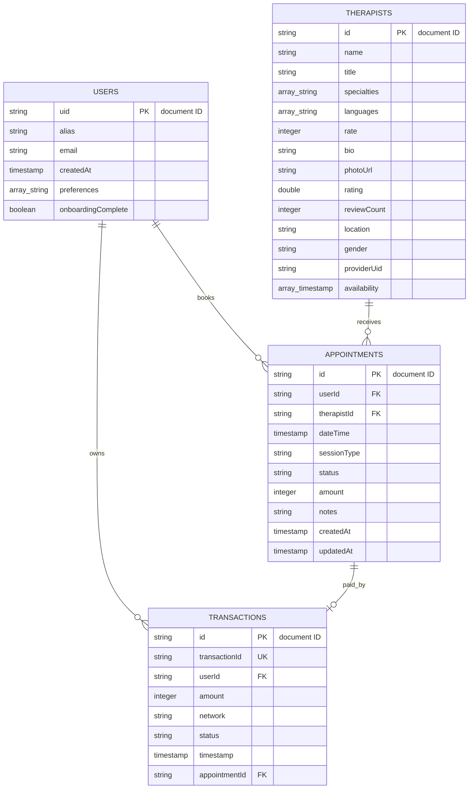

# Solace Firestore Entity-Relationship Diagram

Firestore is document-oriented, so the foreign keys below are logical document
references stored as strings. The names and types match the implemented Dart
models and `firestore.rules`.

## Collections and relationships

| Collection | Document owner | Relationship and purpose |
| --- | --- | --- |
| `users` | `uid` equals Firebase Auth UID | One private alias-based profile per authenticated account. |
| `therapists` | Managed by an administrator | Shared professional directory. `providerUid` optionally links a professional to an Auth account. |
| `appointments` | `userId` | References one `therapists/{therapistId}` document. Users create, reschedule, cancel, and delete their records. |
| `transactions` | `userId` | References one `appointments/{appointmentId}` document and records the selected network and simulated result. |

## Enumerated values

- `appointments.sessionType`: `individual`, `couples`, `group`.
- `appointments.status`: `pending_payment`, `confirmed`, `completed`,
  `cancelled`.
- `transactions.network`: `mtn`, `airtel`.
- `transactions.status`: `pending`, `successful`, `failed`.

The app resolves therapist names from the referenced therapist documents rather
than duplicating them in appointments. This avoids stale duplicated profile
data.
